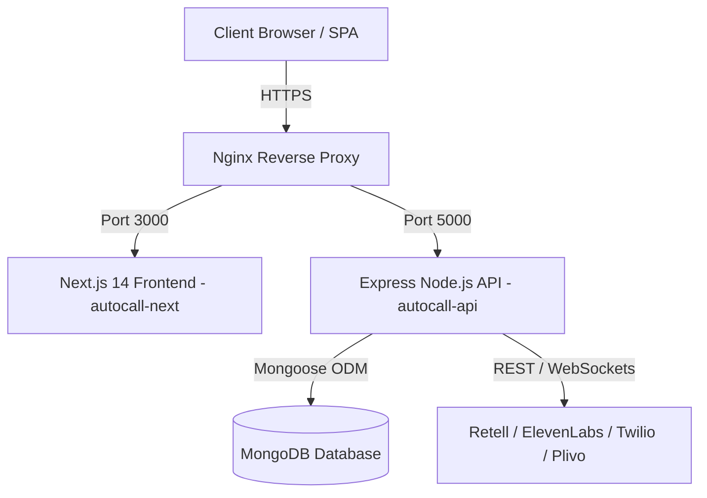

# 🚀 InfiniCall AI — Enterprise Conversational AI Platform
> **Release Version:** `infcall-v10.08.26` (Main Stable Release)  
> **Repository:** [abhishekaddepalli/infinicall-ai](https://github.com/abhishekaddepalli/infinicall-ai)

---

## 🌟 Overview

**InfiniCall AI** is a state-of-the-art, multi-tenant Conversational AI Voice and SMS campaign platform. It empowers businesses and enterprises to deploy intelligent voice agents, manage automated phone call flows, run multi-channel SMS marketing campaigns, and track real-time analytics with seamless billing in **Indian Rupees (₹)** and international currencies.

---

## ✨ Key Features

- 🎙️ **Conversational AI Voice Assistants**: Integrate with Retell AI, ElevenLabs, OpenAI, and Deepgram.
- 📱 **SMS Campaign Hub**: Outbound and inbound automated SMS workflows with custom variable replacement.
- 💳 **Billing & Subscriptions**: Support for Razorpay, Stripe, and PayPal with custom plan management in **Rupees (₹)**.
- 🎨 **Whitelabeling & Custom Branding**: Dynamic tab titles, custom logos, dynamic favicons, and white-labeled email templates.
- 📊 **Real-time Analytics Dashboard**: Live metrics for concurrent calls, agent performance, total revenue, and system logs.
- 🛡️ **Multi-Tenant System & Role Permissions**: Granular access control for Super Admins, Admins, and Team Members.

---

## 🏗️ System Architecture



---

## 📋 Prerequisites

Ensure your system/VPS meets the following minimum requirements:

- **OS**: Ubuntu 22.04 LTS or higher (or Debian / RHEL)
- **Node.js**: `v18.x` or `v20.x` LTS
- **npm**: `v9.x` or higher
- **MongoDB**: `v6.0` or higher (Local or MongoDB Atlas)
- **Process Manager**: `PM2` (`npm install -g pm2`)
- **Web Server**: `Nginx` with Certbot for SSL

---

## 🛠️ Step-by-Step Installation Guide

### Step 1: Clone the Repository

```bash
cd /var/www
git clone https://github.com/abhishekaddepalli/infinicall-ai.git infinicall
cd infinicall
```

---

### Step 2: Backend Setup (`autocall-api`)

1. Navigate to the API directory:
   ```bash
   cd /var/www/infinicall/autocall-api
   ```

2. Install dependencies:
   ```bash
   npm install
   ```

3. Create the environment configuration file (`.env`):
   ```bash
   nano .env
   ```

   Add your configuration settings:
   ```env
   PORT=5000
   NODE_ENV=production
   MONGO_URI=mongodb://127.0.0.1:27017/infinicall_db
   JWT_SECRET=your_super_secret_jwt_key_here
   FRONTEND_URL=https://voice.infiniforge.cloud
   BACKEND_URL=https://voice.infiniforge.cloud/api
   ```

4. Verify database models and initial settings seed:
   ```bash
   node server.js
   ```
   *(Press `Ctrl + C` once you see `✅ Setting collection migrated to InfiniCall AI` and `✅ Default plans auto-seeded into MongoDB`)*

---

### Step 3: Frontend Setup (`autocall-next`)

1. Navigate to the Next.js directory:
   ```bash
   cd /var/www/infinicall/autocall-next
   ```

2. Install dependencies:
   ```bash
   npm install
   ```

3. Create the frontend environment file (`.env.local`):
   ```bash
   nano .env.local
   ```

   Add the API endpoint URL:
   ```env
   NEXT_PUBLIC_API_BASE_URL=https://voice.infiniforge.cloud/api
   NEXT_PUBLIC_APP_NAME=InfiniCall AI
   ```

4. Build the production frontend bundle:
   ```bash
   npm run build
   ```

---

### Step 4: PM2 Process Management

Start both the backend API and Next.js frontend using PM2:

```bash
# Start Backend API
cd /var/www/infinicall/autocall-api
pm2 start server.js --name "autocall-backend"

# Start Frontend Next.js Server
cd /var/www/infinicall/autocall-next
pm2 start npm --name "autocall-frontend" -- start

# Save PM2 process list to auto-start on server boot
pm2 save
pm2 startup
```

---

### Step 5: Nginx Reverse Proxy Configuration

Create an Nginx configuration file for your domain (`/etc/nginx/sites-available/infinicall`):

```nginx
server {
    server_name voice.infiniforge.cloud;

    # Frontend (Next.js)
    location / {
        proxy_pass http://127.0.0.1:3000;
        proxy_http_version 1.1;
        proxy_set_header Upgrade $http_upgrade;
        proxy_set_header Connection 'upgrade';
        proxy_set_header Host $host;
        proxy_cache_bypass $http_upgrade;
    }

    # Backend API & Uploads
    location /api {
        proxy_pass http://127.0.0.1:5000;
        proxy_http_version 1.1;
        proxy_set_header Upgrade $http_upgrade;
        proxy_set_header Connection 'upgrade';
        proxy_set_header Host $host;
        proxy_cache_bypass $http_upgrade;
    }

    location /uploads {
        proxy_pass http://127.0.0.1:5000/uploads;
    }
}
```

Enable the configuration and reload Nginx:
```bash
sudo ln -s /etc/nginx/sites-available/infinicall /etc/nginx/sites-available/
sudo nginx -t
sudo systemctl reload nginx
```

Obtain an SSL certificate with Let's Encrypt Certbot:
```bash
sudo certbot --nginx -d voice.infiniforge.cloud
```

---

## 📌 Main Stable Version Details

- **Version Tag**: `infcall-v10.08.26`
- **Stable Commit**: `7d83aaa` / `faffe85`
- **Branch**: `release/infcall-v10.08.26`
- **Primary Currency**: Indian Rupees (`₹`)
- **App Name**: InfiniCall AI

---

## ❓ Maintenance & Useful Commands

| Action | Command |
| :--- | :--- |
| **Check PM2 Status** | `pm2 status` |
| **View Backend Logs** | `pm2 logs autocall-backend` |
| **View Frontend Logs** | `pm2 logs autocall-frontend` |
| **Restart Backend** | `pm2 restart autocall-backend` |
| **Restart Frontend** | `pm2 restart autocall-frontend` |
| **Update Codebase** | `git pull origin main && npm run build` |

---

Developed with ❤️ for **InfiniCall AI**.
